

# 
Software Requirements Specification for Digital Detoxing Application

###### 
Abdalrhman M. Hemida, Mohamed M. Sallam, Mohamed Sherif, Mohamed Yehia, Yousef Ahmed

## Preface
### Document purpose
The main purpose of this document is to provide details, specifications ,and requirements for our Digital Detoxing App **Awb**.
The document will provide an overview of the system in the first section; then each part will be explained in detail.
### Target users
- As long as our application is open source, our target users include:
    - Supervisor
        - To check whether our system meets our needs or not.
        - Confirm what was agreed upon.
    - Developers
        - Whether they are on a team project or contributors.
    - Testers
        - Use SRS to develop validation tests for the system.
    - Addicted Users
        - people who uses the phone a lot.
### Revision history
Version | Author | Description | Data
-------------|--------------|-------------|-------------
|0.1.0 | whole team | Initial idea | 14-10-2022
|0.1.1 | whole team | CRC Cards | 29-10-2022
|0.1.2 | whole team | Class Diagram | 11-11-2022
|0.1.3 | whole team | Server/Client ERDs | 12-11-2022
|0.1.4 | whole team | Start Implementaion | 25-11-2022
|0.1.5 | whole team | Use-Case Diagram | 5-12-2022
|0.1.6 | whole team | Data Flow Diagram | 8-12-2022
|0.1.7 | whole team | - Update SRS document   - Update CRC cards   - Update Class Diagram    - Update Client ERD | 11-12-2022

## Introduction
### Purpose
**Awb** works with your self-control with the pre-commitment strategy; If the soul is like a baby, as Imam Al-Busairi -may God have mercy on him- said:
>“The soul is like a baby, if you neglect him, he will grow in love with
breastfeeding, and if you wean him, he will be weaned”.
>
**Awb** aims to limit your digital usage to help you achieve the following:
- Minimize the use of social media applications.
- Track and control your phone usage.
- Lock the phone for some time (from 1m to 24h) or more.
- Helping others to quit smartphone addiction.

### Scope 
**Awb** is open-source software for detoxing, it helps to quit digital applications addiction whether they are social media apps or games usually. **Awb** provides users to lock their applications for some time by restricting them and also provides us with scheduling to schedule our lockers.

### Overview  
This document is organized as follows: first, an overview description of **Awb** application and the big picture of our applicatino is presented in (sections 2.1 and 2.2). Section 3 illustrates the definitions, abbreviations, and acronyms. Section 4 states the type of users who can use **Awb**. 
<!-- - Section 1
    - Descripe what SRS is for, who use our system and version of our project.
- Section 2
    - Our system's aims, a brief of our achievements by **Awb**, and list our goals then explain our structre.
- Section 3
    - Talking about acronyms and abbreviatinos. -->
## Glossary  
### Acronyms, definitions, and abbreviations
- **UI**: User interface
- **UX**: User experience
- **API**: Application user interface
- **FOSS**: Free and Open-Source Software
- **Team**: The authors of v1 of the SRS document.
- **Awb**: An Arabic word means "reboot/quiting", "آبَ إيابًا فهو أواب وهي أوابة وذلك أوبٌ حميد".
## System Users
### System stakeholders
#### FOSS Contributors
- Responsible for reporting bugs and security threats.
- Responsible for cleaning and maintaining the code for the FOSS community.
- Responsible for adding, removing, and modifying the source code.
- Responsible for redistributing the code base.
#### App Users
- Responsible for using the app features to quit digital addiction.
- Responsible for reporting bugs and requesting new features.
#### Software Engineering Team
- Responsible for creating the first version of the app.
- Responsible for the development of the app.
- Responsible for writing the first version of the SRS document.
- Responsible for almost what Contributors do.

### Users objectives
#### FOSS Contributors
- Gain experience in studying, reading, modifying, or cleaning the source code.
- Are allowed to distribute the code base to fit their needs.
- Have a good portfolio for employment.
#### App Users
- Have quality time with their family and friends.
- Have a life.
- Quit all forms of digital addiction.
- Have much time to accomplish their life goals.
#### Software Engineering Team
- Gain experience in architecting, designing, coding, documenting, and testing a real-life project in an Agile environment.
- Gain experience in using mainstream industrial technologies (mentioned in section 9.2).
- Have a good portfolio for employment.
- Gain teamwork, self-learning, and presentation skills.

## User Requirements Definition
### System functions
1. Phone locking
2. Whitelisting
3. Detox schedule
4. Detox repetition
5. Flexibility
6. App grouping
7. Devices synchronization

### Constraints
#### Cultural constraints
- All code must follow team standards.
- Version control workflow must follow team convention.
- The team must create -at least- automated tests for the Android app.

#### Hardware limitations
- The app should work on older Android versions properly.
- The app should be able to run on Android TVs.
- The app should work on older PCs.
- No Apple ecosystem support.
## System Architecture

    <figure class="image">
        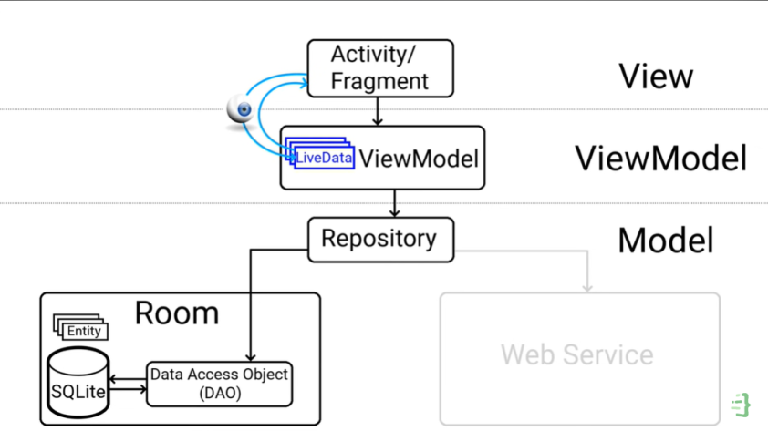
        <figcaption>
                System Architecture
        </figcaption>
    </figure>

<!--new chapter-->
## Functional requirements
### Phone locking  
User can lock his phone (partially or entirely) for a customized amount of time (from 1m to 24h), or more time by accepting a confirmation message.

### Whitelisting 
User select apps which will be used during the detox period, others will be locked.

### Detox schedule
User can schedule his detoxing periods,and here's the user story:
1. User enters a period of time (e.g., from 11pm to 8am).
1. User chooses how many times he want that detoxing period to be repeated (e,g daily or weekly).
1. User chooses the apps to lock from his app groups, he created before, or create a custom group.
1. User chooses the devices to lock and choose thier app groups, he wants to block.

### App grouping
User can create a group of apps with a name to be treated as one app (in usage time) i.e., social media apps, studying apps ... etc.

### Link multiple devices
User can lock all synchronized devices with only one click.

### Allow users to change wallpaper
The program is an Apps launcher like others but with Digital Detoxing features, so we allow user to change his wallpaper.

## Interface Requirements

### User interfaces
- UI: Figma.
- UX: simple and minimal.

    <figure class="image">
        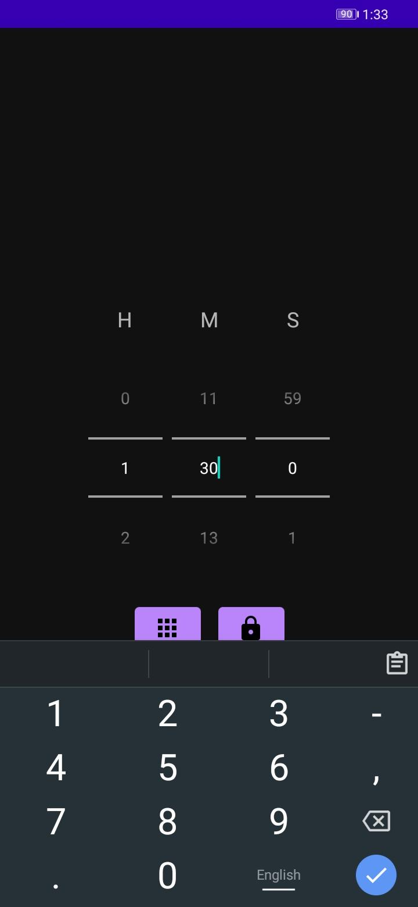
        <figcaption>
                User enters the detoxing period
        </figcaption>
    </figure>

    <figure class="image">
        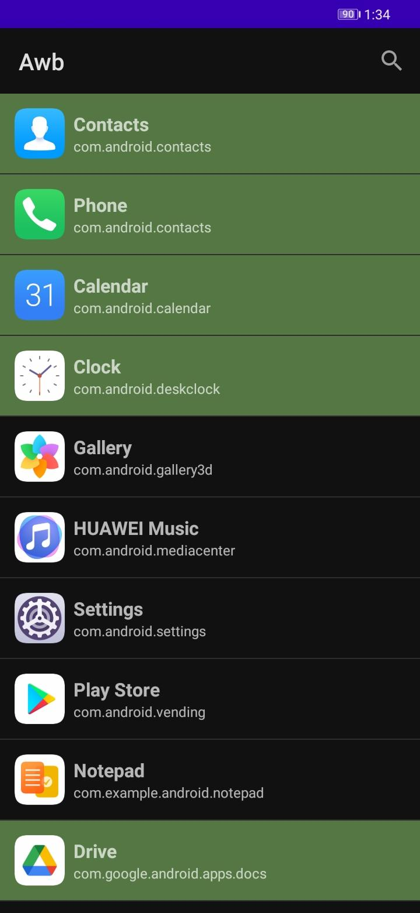
        <figcaption>
                User selecting useful apps
        </figcaption>
    </figure>

    <figure class="image">
        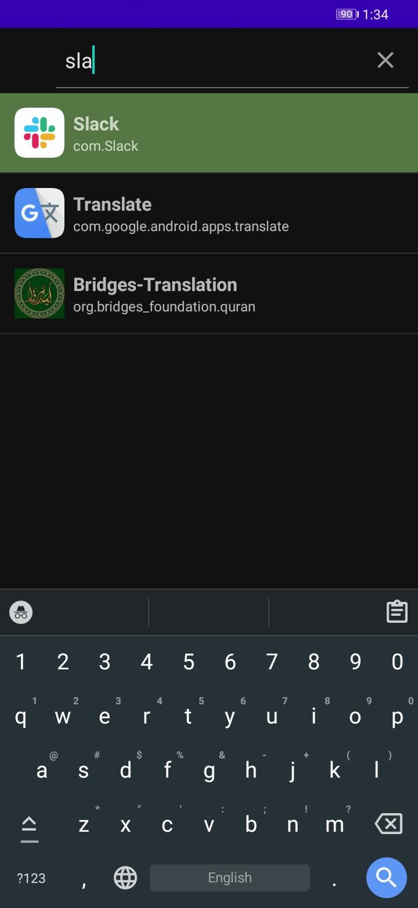
        <figcaption>
                User search about an app
        </figcaption>
    </figure>

    <figure class="image">
        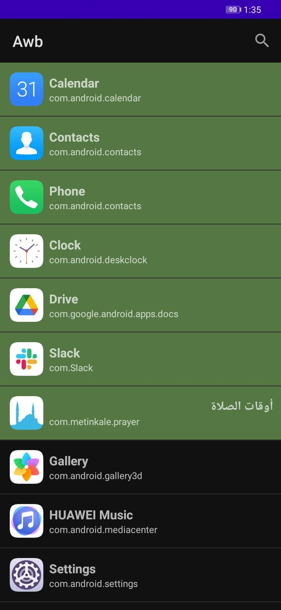
        <figcaption>
                User satisfied with his choice
        </figcaption>
    </figure>

    <figure class="image">
        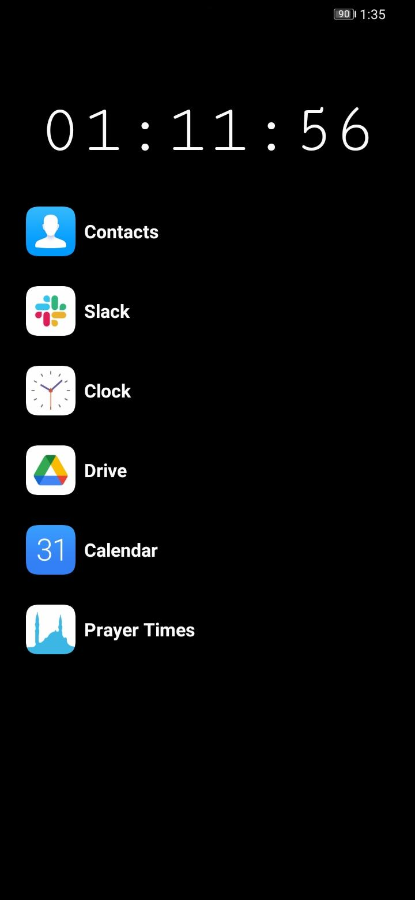
        <figcaption>
                Launcher countdown
        </figcaption>
    </figure>

    <figure class="image">
        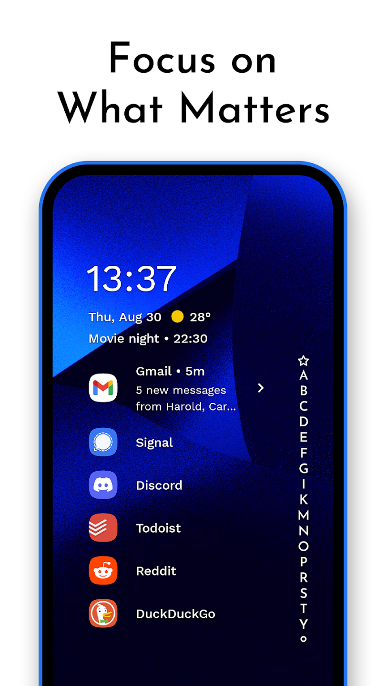
        <figcaption>
                Minimal launcher with wallpaper
        </figcaption>
    </figure>

    <figure class="image">
        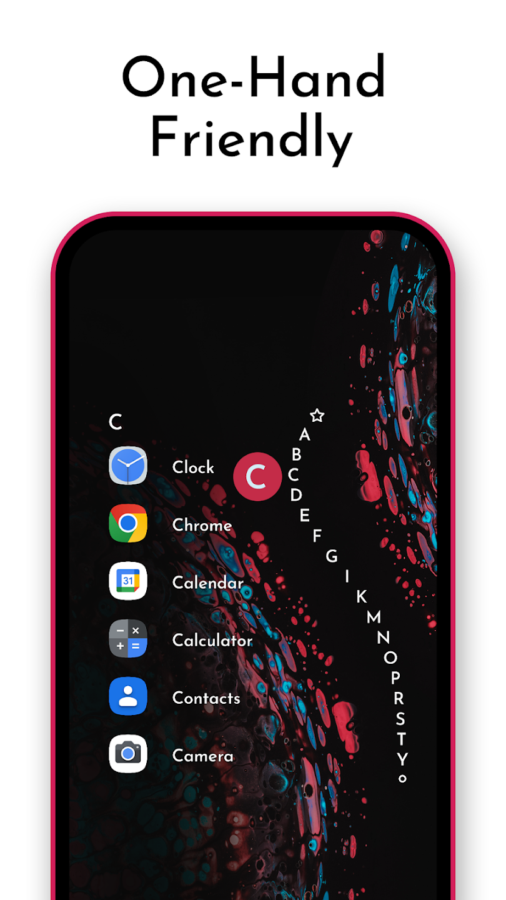
        <figcaption>
                Minimal launcher with easy-to-use navigator
        </figcaption>
    </figure>

    <figure class="image">
        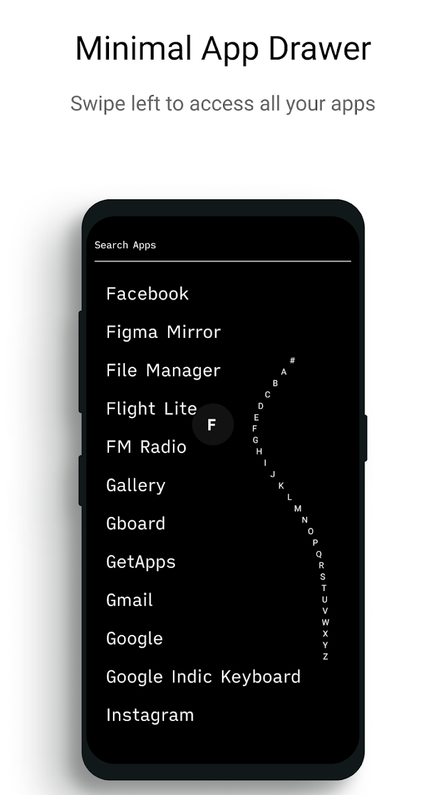
        <figcaption>
                Minimal launcher with easy-to-use navigator
        </figcaption>
    </figure>

### Software interfaces
Database access will be wrapped through Object Relation Mapping Framework (JDBC Framework).

### Communications interfaces 
#### Database communication
- Application-Database communication will be through TCP/IP Communication on port 1433.
- Client will access the server through HTTPS protocol. 
<!--new chapter-->
## Non-functional Requirements 
### General 
#### Reliability
Impossible to break the lock even if you restart the phone unlike the other apps so we made it an apps launcher. 
#### High performance 
- Low response time
- Lightweight, fast and minimal
#### Security 
<!---OL---> 
1. **Awb** does not collect any data, even metadata, about you in any way with or without your consent.
1. The exchange of data between server and user is minimal.
1. Database cannot capture anything used to control devices.
1. Public and private keys are used in QR code form to provide user authentication. 
1. HTTPS protocol is used in the exchange of data between client and server which provides a layer of protection through encryption and authentication.    
#### Free and open-source
A free and open-source launcher with no Ads presented so any contributor can review, edit or redistribute the source code and report bugs and security threats if any.
### Technologies
- Build Tool for Java: Gradle
- Unit Test for Java: JUnit & Mockito 
- Spring Boot for Server-Side Logic
- Client-Server Communication: REST APIs
- Database: PostgreSQL vs MySQL <!--yousef:evaluation-->
- Build Tool for Qt C++: CMake
- Unit Test for Qt C++: QtTest, GoogleTest or CppUnit <!--evaluation-->
<!--new chapter-->
## System Models and Diagrams 

    <figure class="image">
        
        <figcaption>
                Use-Case Diagram
        </figcaption>
    </figure>

    <figure class="image">
        
        <figcaption>
                DFD Level 0 | Context Diagram
        </figcaption>
    </figure>

    <figure class="image">
        
        <figcaption>
                DFD Level 1
        </figcaption>
    </figure>

    <figure class="image">
        
        <figcaption>
                DFD Level 2
        </figcaption>
    </figure>

    <figure class="image">
        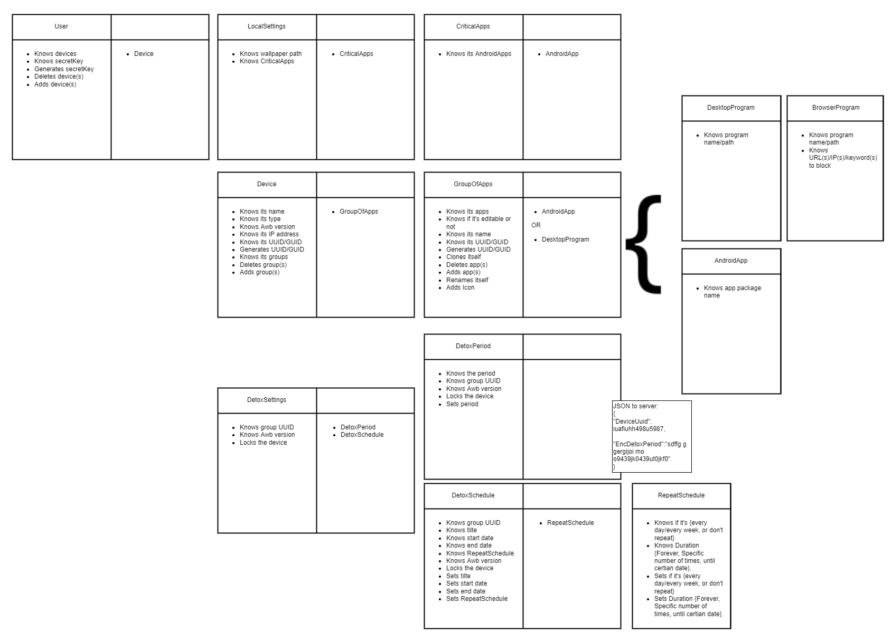
        <figcaption>
                CRC Cards
        </figcaption>
    </figure>

    <figure class="image">
        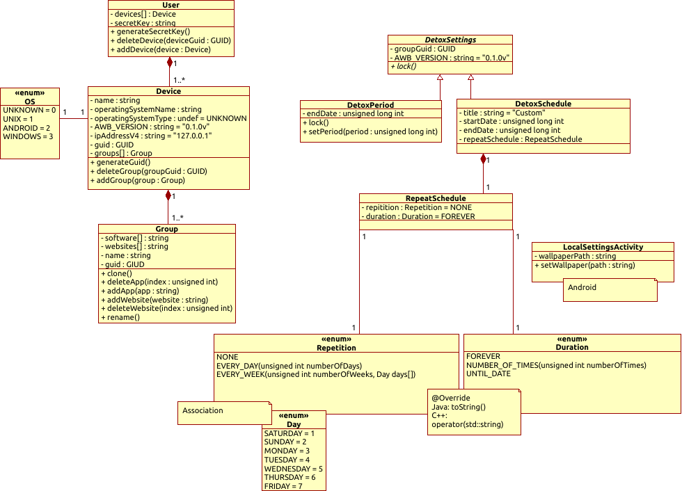
        <figcaption>
                Class Diagram
        </figcaption>
    </figure>

    <figure class="image">
        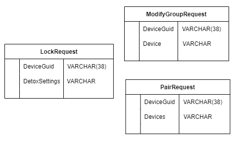
        <figcaption>
                Server-Side ERD
        </figcaption>
    </figure>

    <figure class="image">
        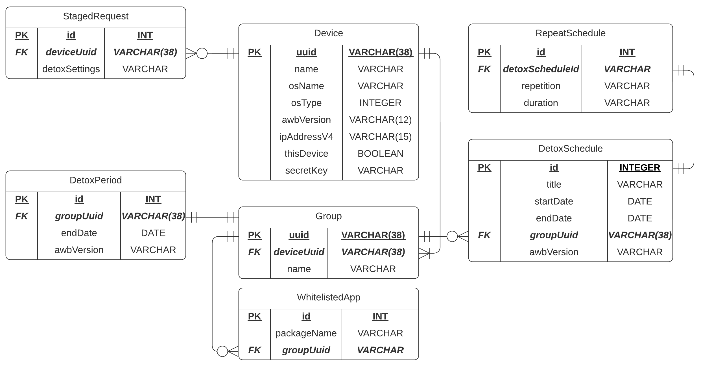
        <figcaption>
                Client-Side ERD
        </figcaption>
    </figure>

## System Evolution
- The application shall work on new versions of OSs (Unix, Android and Windows).
- The application shall run on new versions of hardware devices. 
## Time Plan
### Work breakdown structure  
### Gantt chart

